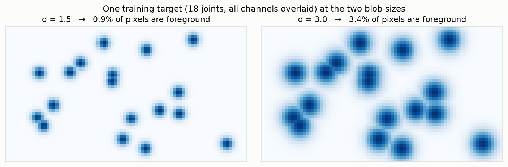
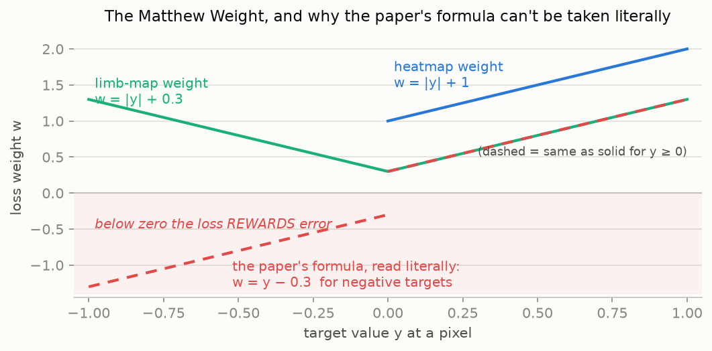
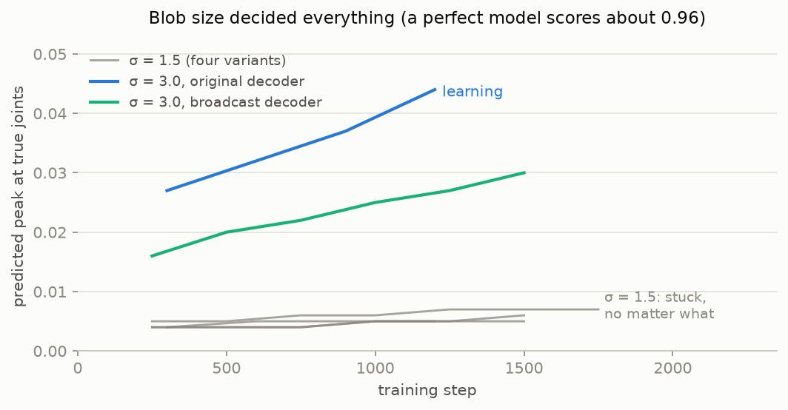
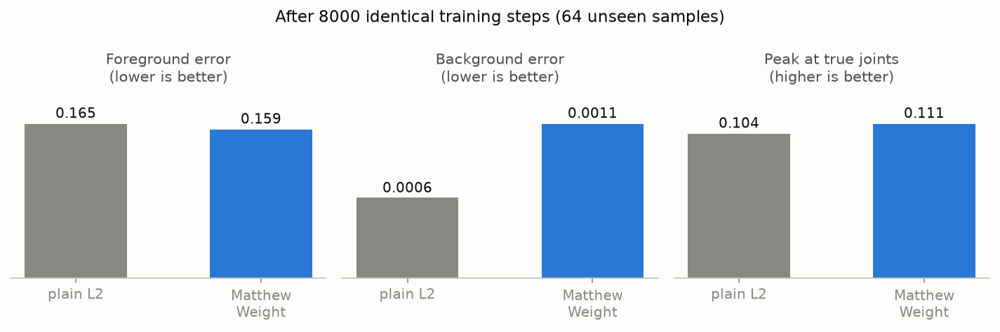
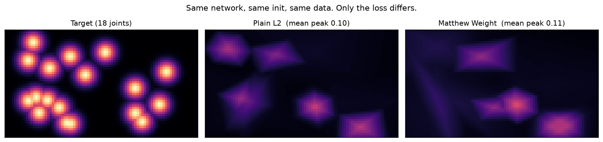
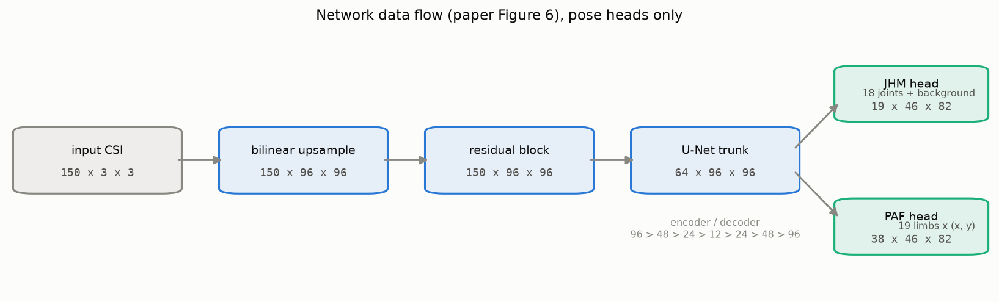
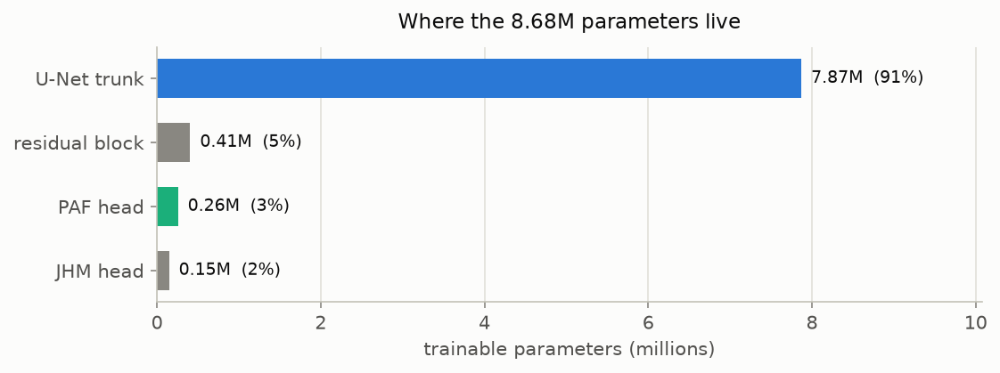

# Estimating human pose from WiFi signals

This repo is a from-scratch reproduction of **[Person-in-WiFi](https://arxiv.org/abs/1904.00276)**
(ICCV 2019), a paper that showed you can estimate where a person's body joints are
(head, shoulders, elbows, knees) using nothing but ordinary WiFi signals. No camera,
no radar, no wearables. The person just has to be standing between a WiFi transmitter
and receiver.

The catch: the authors were never able to release their code or their data (their
ethics approval didn't allow it). So everything here is rebuilt from the paper's
description alone and trained on substitute public data. The goal is to reproduce
the *pipeline* and its qualitative findings, not the exact numbers.

## How can WiFi see a body?

WiFi signals bounce. When a signal travels from a router to a receiver, it doesn't
take one path. It reflects off walls, furniture, and people, and all those echoes
overlap at the receiver. A body in the room changes the echo pattern, and when the
body moves, the pattern changes with it.

Commodity WiFi hardware can report this pattern in surprising detail. It's called
**CSI (Channel State Information)**: for each of 30 radio frequencies, and for each
of the 9 transmit/receive antenna pairs (3 antennas on each side), the receiver
measures how much that frequency got distorted along the way. The paper samples this
100 times per second. Bundling 5 consecutive samples gives 5 × 30 × 3 × 3 = 1,350
numbers per instant: a kind of blurry acoustic photograph of the room, taken with
radio waves.

The task of the neural network is to turn those 1,350 numbers into **joint heatmaps**:
one small image per body joint (18 of them), bright where that joint is, dark
everywhere else. A second output, **part affinity fields**, encodes which joints
connect to which (the skeleton's limbs), so that multiple people in the same room
can be untangled. This output format is borrowed from OpenPose, a standard
camera-based pose estimator, which is also what generates the training labels: during
data collection a camera watches the scene alongside the WiFi receiver, a vision
model labels the poses, and the WiFi network learns to imitate it. At test time the
camera goes away.

## Project plan and status

| Stage | What | State |
|---|---|---|
| 1 | The paper's special loss function, tested in isolation | **done** |
| 2 | The paper's network architecture, with shape/sanity tests | **done** |
| 3 | Data loading + label rendering for the public Wi-Pose dataset | next |
| 4 | Full training and evaluation (on cloud GPUs) | not started |
| 5 | A physics-based synthetic CSI generator; the MM-Fi dataset | not started |

What's in the repo right now:

```
piw/losses.py        the Matthew Weight loss (the paper's key trick)
piw/network.py       the network: CSI tensor in, joint + limb maps out
piw/skeleton.py      the 18 joints and 19 limbs, and the head channel counts
tests/               unit tests for the loss and the network
mw_vs_l2_toy.py      stage-1 experiment: does the loss actually help?
mw_vs_l2.png         its output figure
stage2_network_check.py   prints the network's output shapes and size
figs/                figures for this README + the script that makes them
docs/research_notes.md   background research: the paper, datasets, hardware
CLAUDE.md            working spec for the project
```

## Stage 1: the Matthew Weight loss

### The problem it solves

A joint heatmap is almost entirely empty. At the paper's resolution (46 × 82 pixels),
a joint is a small Gaussian blob and everything else is zero:



Train a network on this with the standard mean-squared-error loss and you hit a
classic failure: since ~99% of pixels are background, the network can score ~99%
correct by predicting *all black, always*. The blobs contribute almost nothing to
the average error, so they get washed out.

The paper's fix is to weight each pixel's error by how bright the target is, so
mistakes on joints cost more than mistakes on background. They call it the
**Matthew Weight**, after the "rich get richer" Matthew effect:

```
loss = mean( w · (prediction − target)² )      with   w = k·|target| + b
```

For heatmaps, k = 1 and b = 1, so weights run from 1 (background) to 2 (blob
center). For the limb maps, k = 1 and b = 0.3.

One wrinkle: the paper actually prints the weight as `w = k·y + b·I(y)` where `I` is
+1 for positive targets and −1 for negative ones. Limb-map targets can be negative
(they're direction vectors), and for those the printed formula produces a *negative*
weight, which would flip the sign of the error term and reward the network for
being wrong. That can't be what they meant, so this repo uses the absolute-value
form, which is identical wherever targets are non-negative:



The implementation is ~15 lines in [piw/losses.py](piw/losses.py), and
[tests/test_losses.py](tests/test_losses.py) pins it down: one test checks the
arithmetic against a 2×2 example computed by hand, one proves the weights stay
positive exactly where the paper's literal formula would go negative, and one checks
that setting k = 0, b = 1 recovers plain mean-squared error.

### The experiment: same network twice, only the loss differs

To measure what the loss contributes (and nothing else), the experiment trains two
networks that are identical in every way random seeds can enforce: same starting
weights, same sequence of training batches, same optimizer. One trains with plain
MSE, the other with the Matthew Weight. Any difference in the outcome is then
attributable to the loss alone.

The data is synthetic: random 18-joint "poses" rendered as target heatmaps, and a
scrambled 64-number measurement derived from the joint positions standing in for
CSI. Fake, but it preserves the two properties that matter: the input is a
low-dimensional scrambled function of the pose, and the output is sparse.

### What happened first: nothing

The first version of this experiment silently couldn't work, in two separate ways,
and both were only found by running it and watching it fail.

**A self-destructing network.** The original network ended a layer stack with a
ReLU, an activation that outputs zero for any negative input. The optimizer
discovered that the quickest way to cut the loss was to predict "all black," and it
got there by driving that entire layer negative. Output: a frozen constant. And
since a zeroed ReLU passes no learning signal backward, the network could never
recover: it had welded itself shut after about 200 steps. Watching the fraction
of dead units climb from 55% to 92% while the gradients shrank a thousandfold made
the diagnosis unambiguous.

**A task too sparse to learn.** With the ReLU removed the network stayed trainable,
but still learned nothing. Turns out that at the paper's blob size (σ = 1.5 pixels,
0.9% of pixels lit) this toy task is effectively unlearnable at toy scale, and not
for lack of trying:



Everything in gray was a dead end: training 4,000+ steps instead of 600, raising
the learning rate 3× and 10×, switching to a sinusoidal input encoding, iterating
over a fixed dataset instead of endless fresh samples, and swapping in a different
decoder architecture. One control experiment settled where the problem lives: even
when the network was handed the *unscrambled joint coordinates* as input, it still
couldn't paint the blobs. The bottleneck was never decoding the measurement; it's
that with 0.9% foreground, the "all black" solution is a hole too deep for gradient
descent to climb out of at this scale.

The single change that mattered was making the blobs wider (σ = 3.0, 3.4% of pixels
lit). Both curves in color are the same setups that flatlined at σ = 1.5. The full
Wi-Pose training in stage 4 keeps the paper's σ ≈ 1.5, where a much larger network
and 132,000 real samples face a related but not identical problem. This stage-1
lesson is a warning to watch for the same collapse there, not a change to that plan.

### The result

With the task in a learnable regime, the two-network comparison finally means
something. After 8,000 identical training steps, measured on 64 unseen samples:



| | plain L2 | Matthew Weight | difference |
|---|---|---|---|
| foreground error (MSE) | 0.165 | 0.159 | −3.6% |
| background error (MSE) | 0.00059 | 0.00113 | +91% |
| peak height at true joints | 0.104 | 0.111 | +6.7% |

And the picture the numbers summarize (one test sample, all joint channels overlaid):



Reading this fairly: the Matthew Weight wins on both foreground measures and pays
for it with a noisier background, which is exactly the trade it advertises, since
all it does is shift attention toward bright pixels. But the margin is modest, not
dramatic, and the arithmetic says it has to be: with weights capped at 2× and ~97%
of the loss still coming from background pixels, a 2:1 reweighting cannot dominate
anything. Two caveats for honesty's sake: this is one seed (the margin hasn't been
tested for stability across random restarts), and both models are still far from
the ceiling of ~0.96, since at 8,000 steps they've learned coarse locations, not
sharp peaks. The claim this stage supports is precise but narrow: *same network,
same data, same budget, and the reweighted loss localizes measurably better on
sparse targets.* The dramatic version of the claim (paper, Figure 7) belongs to
full-scale training and stage 4 will test it there.

## Stage 2: the network

The paper's architecture (its Figure 6), rebuilt in [piw/network.py](piw/network.py).
The flow is: take the 150×3×3 CSI tensor (150 channels = 5 time samples × 30
frequencies, 3×3 = the antenna grid), bilinear-upsample the antenna grid to 96×96,
pass it through a residual block and a U-Net, then split into two output heads. The
heads use a strided convolution to land on the exact 46×82 label resolution (stride
2 on height, stride 1 on width, which forces a 6×15 kernel). The paper's third head,
person segmentation, is left out because the substitute dataset has no masks.



A random forward pass produces exactly the shapes the paper specifies:

```
input                  (2, 150, 3, 3)
after bilinear upsample (2, 150, 96, 96)
JHM head (joints + bg) (2, 19, 46, 82)      18 joints + 1 background
PAF head (limbs × 2)   (2, 38, 46, 82)      19 limbs × (x, y)
```

The whole network is 8.68 million parameters, and almost all of them (91%) sit in
the U-Net trunk. The two output heads are tiny by comparison:



The tests in [tests/test_network.py](tests/test_network.py) check the output shapes
at several batch sizes, confirm a backward pass fills every parameter with a finite
gradient (so it can actually train), and confirm the head sizes are configurable for
later datasets with different joint counts. Run the shape/size report yourself with
`python stage2_network_check.py`.

Note on faithfulness: the parts the paper pins down (the input tensor, the 96×96
upsample, the residual-then-U-Net structure, the two head output shapes, and the
stride rule) are matched exactly. The U-Net's interior (its depth, channel widths,
and normalization) is a standard reconstruction, because the original authors never
released their code and the paper does not give per-layer specifications. Those
interior choices are the natural place to tune if Stage 4 training calls for it.

## Running it

Needs Python 3.10+ (developed on 3.14). CPU only, no GPU required.

```
git clone https://github.com/adityagit94/Person-in-wifi.git
cd Person-in-wifi
python -m venv .venv
.venv\Scripts\activate            # Windows    (Linux/macOS: source .venv/bin/activate)
pip install -r requirements.txt
pytest tests -v                   # unit tests for the loss (seconds)
python mw_vs_l2_toy.py            # the stage-1 experiment (~10 min on CPU)
python figs/make_figs.py          # regenerate the README figures (seconds)
```

## What comes next

**Stage 3: real data.** The public [Wi-Pose dataset](https://github.com/NjtechCVLab/Wi-PoseDataset):
166,600 packets of real CSI from 12 volunteers doing 12 actions, with 18-joint
skeletons labeled by a vision model. Work here is a data loader (starting by opening
a single .mat file and checking what's actually inside), label rendering (Gaussian
heatmaps and limb vector fields at 46×82), and a visual check that rendered labels
sit on the skeletons. Joints the vision model labeled with low confidence get masked
out of the loss; a teacher's mistakes shouldn't become the student's targets.

**Stage 4: training and evaluation.** 20 epochs over the official 132,847-sample
split, on Colab/Kaggle GPUs rather than locally. The metric is PCK@0.2, the
fraction of predicted joints landing within 20% of the person's bounding-box
diagonal of the truth. Two things to look for: absolute scores in the same league
as the paper's 78.75, and the same per-body-part ordering the paper found (torso
and arms easiest, head and feet hardest, since small parts scatter 12.5 cm radio
waves poorly). Known limitation, straight from the paper: models like this largely
memorize the room. The paper's own accuracy collapsed in rooms it wasn't trained
in, so the same collapse here is expected behavior, not a bug.

**Stage 5: beyond.** A physics-based CSI simulator (model the room as a sum of
signal paths: static reflections plus one moving echo per body joint) to generate
unlimited synthetic training data, then the larger multi-modal
[MM-Fi dataset](https://github.com/ybhbingo/MMFi_dataset) for a more rigorous test.

## Sources

- Wang et al., *Person-in-WiFi: Fine-grained Person Perception using WiFi*, ICCV 2019 ([arXiv:1904.00276](https://arxiv.org/abs/1904.00276))
- Cao et al., *OpenPose: Realtime Multi-Person 2D Pose Estimation using Part Affinity Fields* (the output format and labeling teacher)
- [Wi-Pose dataset](https://github.com/NjtechCVLab/Wi-PoseDataset) (NjtechCVLab): the training data for stages 3 and 4
- [docs/research_notes.md](docs/research_notes.md): a longer survey of the paper, its successors, datasets, and CSI hardware
